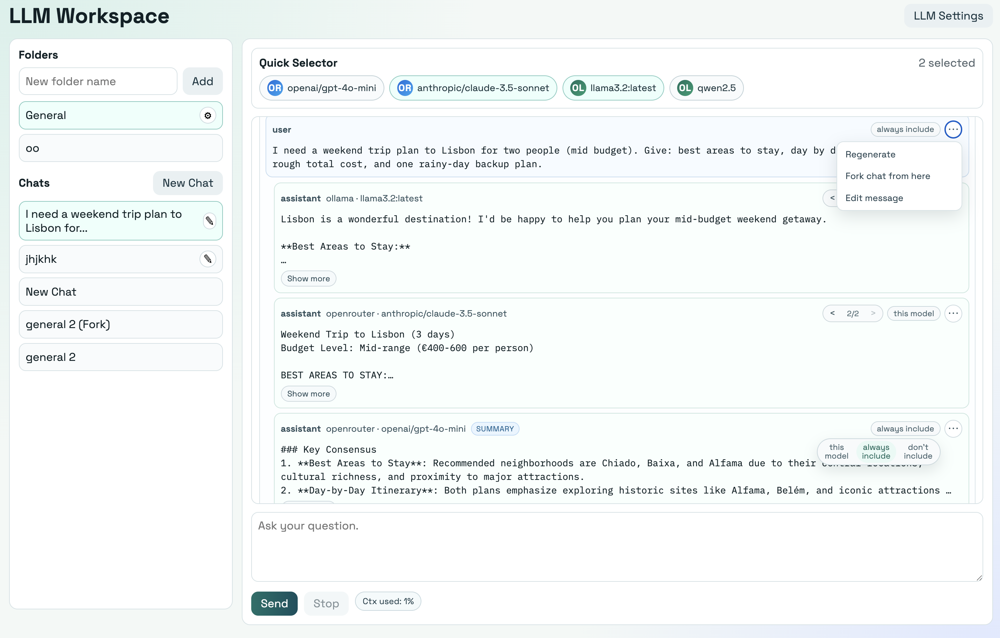

# LLM Workspace

Angular + Go workspace llm chat.


## Features

- Use many models in one chat request (configure models from OpenRouter or Ollama).
- Organize chats into folders and specify system prompt and temperature.
- Create summary answers, Edit, regenerate or fork messages.
- Move chats between folders and rename chats.
- Show per message history.
- See context usage (%) for selected models.

## Project Structure

- `frontend/` Angular app
- `backend/` Go API + provider adapters + persisted state
- `backend/data/state.json` local app state

## Run Locally

### 1) Start backend

```bash
cd backend
go run .
```

Backend listens on `http://localhost:8080`.

### 2) Start frontend

```bash
cd frontend
npm install
npm run start
```

Frontend runs on `http://localhost:4200` and calls the backend at `http://localhost:8080`.

## Build

### Frontend production build

```bash
cd frontend
npm run build
```

### Backend build

```bash
cd backend
go build ./...
```
